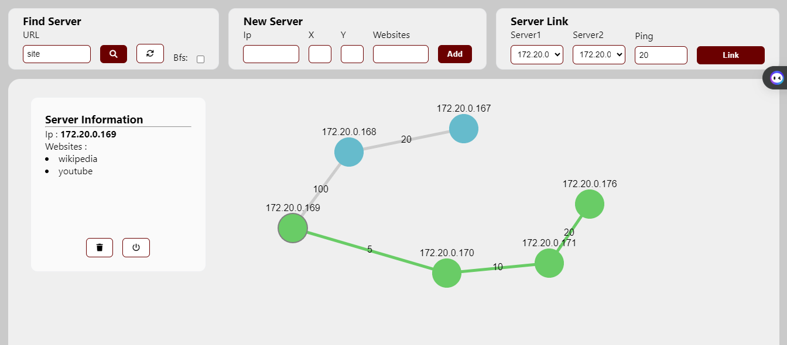

# Network Simulator

## Introduction

This project is a network simulator built using HTML, CSS, JavaScript, and the Cytoscape library for network visualization. It uses Dijkstra's and BFS algorithm to find the shortest and the closest path from a server to another.



## Getting Started

**Directory Structure:**

* **index.html**: It is the main structure of the project
* **assets/**:
  * **css**: Contains all the css file for the project
  * **icons**: Contains a collection of icons from fontawesome
  * **js**: Contains the main logic of the project. We can find all the js file in there

**Prerequisites:**

- Node JS
- Any modern browser

### Running the Project

1. Clone the project into your computer
2. Open terminal inside the project directory
3. Now, run the following commands (you need internet access for this part):

   ```bash
       npm install cytoscape
   ```

This will install the necessary package to run the project

1. Now click on index.html and you are good!.

## Feature

* **Node Management:**

  * Add new nodes to the network.
  * Delete existing nodes.

* **Link Management:**

  * Establish connections (ping links) between nodes.
  * Update existing connections.

* **Server Simulation:**

  * Simulate a server node within the network.
  * Turn on/off a server

* **Pathfinding Algorithms:**

  * Implement Dijkstra's algorithm to find the shortest path (optimal server) from a starting point to any other node.
  * Implement Breadth-First Search (BFS) algorithm for pathfinding exploration (optional).

## Contributing

Contributions are welcome. Please feel free to fork the project and submit your pull requests by :

* Implementing additional features based.
* Improving the existing code.
* Adding documentation and comments.

## License

This project is licensed under the MIT License. This license grants you permission to freely use, modify, and distribute this software under certain conditions. Please refer to the [LICENSE](./LICENSE) file for more details.

## Contact

You can reach me at: [sandratrarafa@gmail.com](mailto:sandratrarafa@gmai.com)
